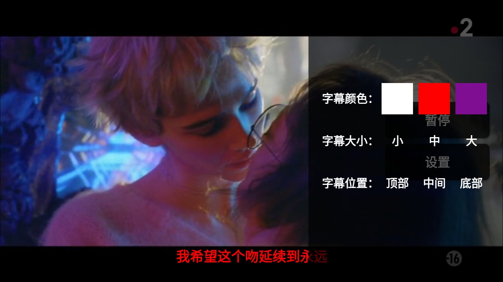

CSDN blog: https://blog.csdn.net/han_han_1/article/details/86747472

[  ](https://bintray.com/averyzhong/AndroidRepo/subtitle-for-android/1.0.6/link)

# Android外挂字幕组件库（Subtitle For Android)


## 概述
Subtitle For Android 是一个Android平台视频播放多字幕支持库，几乎支持所有的Android版本，可以在需要外挂字幕中的项目集成。支持的字幕格式有：.SRT、.SCC、.ASS、.STL、.TTML格式的字幕文件。集成方式简单，可几行代码就可以使你的播放器支持外挂做字幕的支持

## 下载

```
implementation 'com.avery:subtitle:1.0.6' // 最新版本号请看上面"Download"气泡后面的数字
```

>
> 如果Gradle同步出现如下错误：
> Manifest merger failed : uses-sdk:minSdkVersion xx cannot be smaller than version xx declared in library [com.avery:subtitle:x.x.x]
>
>请在`AndroidManifest.xml`中加入`<uses-sdk tools:overrideLibrary="com.avery.subtitle"/>`
>

## 怎样使用？
1. 在播放器布局文件中添加`SimpleSubtitleView`

```
<com.avery.subtitle.widget.SimpleSubtitleView
        android:id="@+id/subtitle_view"
        android:layout_width="match_parent"
        android:layout_height="wrap_content"
        android:layout_alignParentBottom="true"
        android:gravity="center"
        android:text="字幕将在这里显示"
        android:textColor="#ffffff"
        android:textSize="26sp"
        android:textStyle="bold"/>

```

2. 绑定`MediaPlayer`到`SimpleSubtitleView`

```
  private SimpleSubtitleView mSubtitleView;

   ....省略无关代码.....

  mVideoView.setOnPreparedListener(new MediaPlayer.OnPreparedListener() {
             @Override
             public void onPrepared(final MediaPlayer mp) {
                 // 绑定MediaPlayer
                 mSubtitleView.bindToMediaPlayer(mp);
                 // 设置字幕
                 mSubtitleView.setSubtitlePath(SUBTITLE_URL);
             }
         });
   mVideoView.setVideoURI(Uri.parse(VIDEO_URL));

    ....省略无关代码.....


   @Override
   protected void onDestroy() {
         mSubtitleView.destroy(); // 记得销毁
         super.onDestroy();
   }

```

`SimpleSubtitleView`还有其他与`Activity`生命周期相似的方法：`start()`，`pause()`，`resume()`，`stop()`，`reset()` 可以根据具体集成情况在适当的地方进行调用。

## 字幕样式设置
`SimpleSubtitleView`继承自`TextView`，所以`TextView`的所有样式设置都适用于`SimpleSubtitleView`，如设置字幕颜色、字幕大小、字幕对其方式等。

## 注意！！！
> 1. 最好在`MediaPlayer`初始化完成后才能调用`SimpleSubtitleView.setSubtitlePath()`方法，最好的时机是在MediaPlayer的`onPrepared`回调方法里调用`SimpleSubtitleView.setSubtitlePath()`。
> 2. 最好在`MediaPlayer`销毁之前先销毁`SimpleSubtitleView`，即调用`SimpleSubtitleView.destroy()`，最好的时机是在调用`MediaPlayer.release()`方法前先调用调用`SimpleSubtitleView.destroy()`。


## 自定义字幕显示控件
如果不想使用提供的`SimpleSubtitleView`控件，你还可以轻松自定义你自己的显示控件，只需通过
`DefaultSubtitleEngine`来辅助就能办到

```
....
 private SubtitleEngine mSubtitleEngine = new DefaultSubtitleEngine();

 mSubtitleEngine.setOnSubtitlePreparedListener(new OnSubtitlePreparedListener() {
        @Override
        public void onSubtitlePrepared(@Nullable final List<Subtitle> subtitles) {
                // 启动字幕刷新任务
                mSubtitleEngine.start();
           }
        });

 mSubtitleEngine.setOnSubtitleChangeListener(new OnSubtitleChangeListener() {
        @Override
         public void onSubtitleChanged(@Nullable final Subtitle subtitle) {
                // 拿到Subtitle对象来刷新你自定义过的字幕显示控件，注意subtitle可能为空
                // 当subtitle为空时，你应该清除自定义控件已显示的字幕显示
                .......
           }
        });
....
```

自定义的最后一步就是通过`DefaultSubtitleEngine`的生命周期相应方法：`start()`，`pause()`，`resume()`，`stop()`，`reset()`处理好控件的生命周期，以免导致bug。

## 快照



## License
```
Copyright 2019 AveryZhong

Licensed under the Apache License, Version 2.0 (the "License");
you may not use this file except in compliance with the License.
You may obtain a copy of the License at

   http://www.apache.org/licenses/LICENSE-2.0

Unless required by applicable law or agreed to in writing, software
distributed under the License is distributed on an "AS IS" BASIS,
WITHOUT WARRANTIES OR CONDITIONS OF ANY KIND, either express or implied.
See the License for the specific language governing permissions and
limitations under the License.
```
